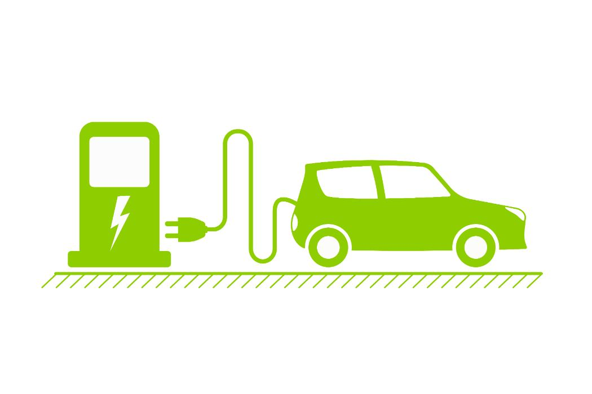

# EVNews
<h2>API model for extracting updated news on Electric Vehicles</h2> 

About: 
Electric vehicles (EV) are vehicles that use electric motors as a source of propulsion. EVs utilize an onboard electricity storage system as a source of energy and have zero tailpipe emissions. Modern EVs have an efficiency of 59-62% converting electrical energy from the storage system to the wheels. EVs have a driving range of about 60-400 km before needing recharging 

Tools Ued: 
-VSCode [IDE]

Libraries & Frameworks Used: 
-nodejs 
-express 
-axios 
-cheerio 

